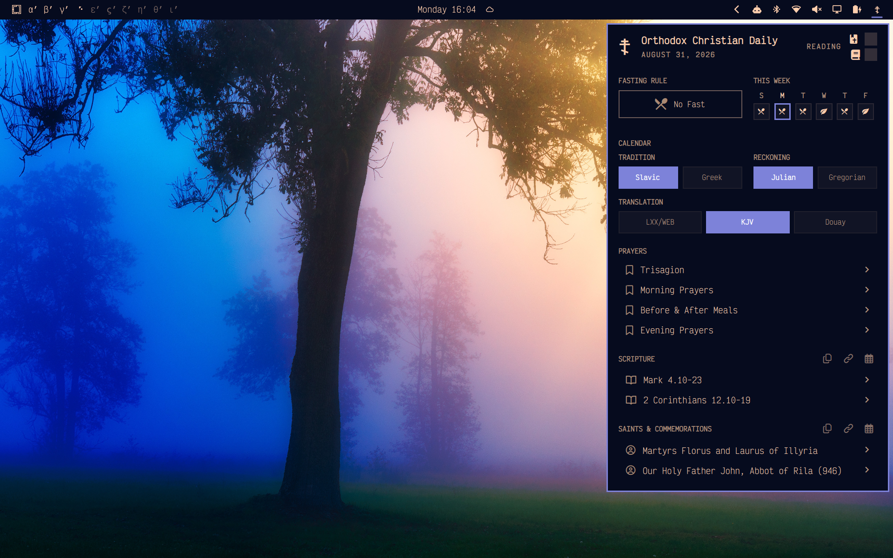
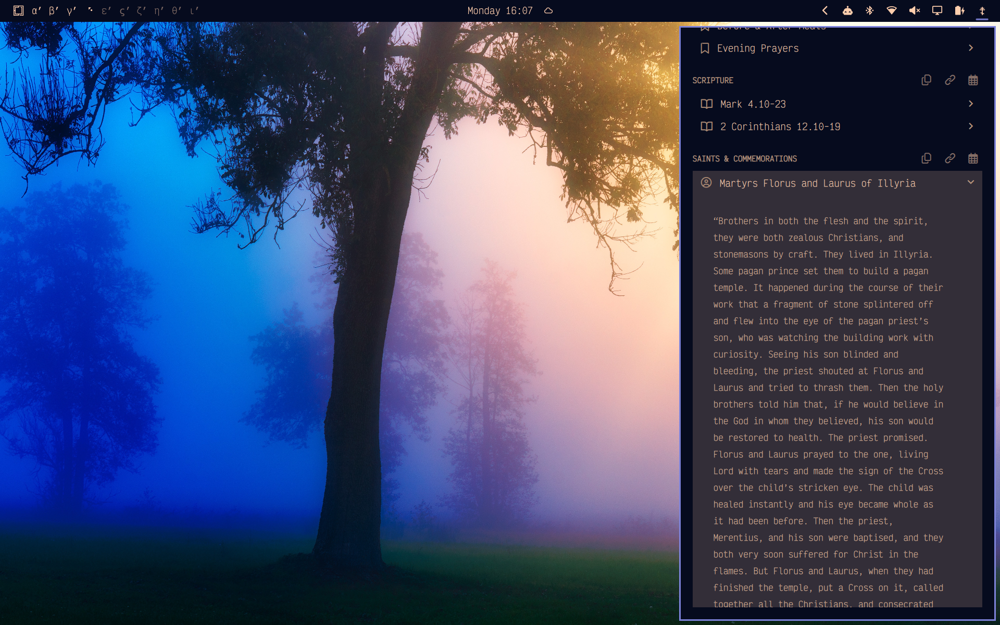
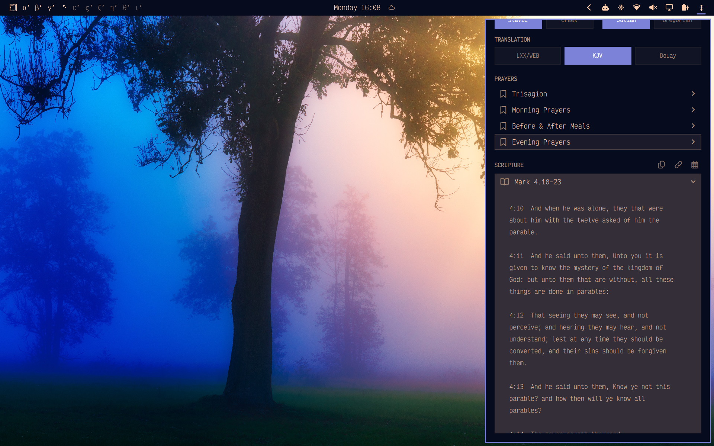
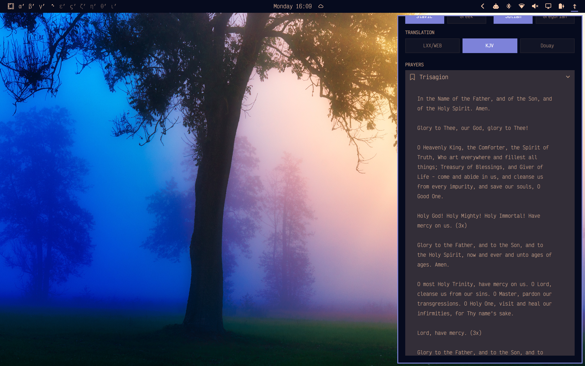

# Pan-Orthodox Daily

## Attribution

This project is based on the MIT-licensed [Orthodox Daily](https://github.com/TyRichards/omarchy-orthodox-daily) Omarchy plugin.

- [Ty Richards](https://github.com/TyRichards) — original creator of Orthodox Daily.
- [Josh Land](https://github.com/joshland) — contributed the upstream PR for calendar selection, Greek/Slavic tradition selection, and Bible translation switching including KJV support: [TyRichards/omarchy-orthodox-daily#3](https://github.com/TyRichards/omarchy-orthodox-daily/pull/3).

## Overview

Pan-Orthodox Daily is an Omarchy bar widget for Orthodox daily readings, fasting guidance, feast/saint commemorations, and reading habit tracking.

It is designed to support both Old Calendar and New Calendar parish life by exposing Orthocal's calendar and tradition choices directly in the widget.









## Features

- Daily Orthodox calendar data from [Orthocal.info](https://orthocal.info/)
- Selectable liturgical tradition: Slavic or Greek
- Selectable calendar reckoning: Julian / Old Calendar or Gregorian / New Calendar
- Selectable Scripture translation: LXX2012 + WEB, King James Version, or Douay-Rheims
- Daily fasting rule and major-fast/Pascha banners
- Week-at-a-glance fasting and feast preview
- Reading tracking: Scripture & Psalter and Spiritual Reading
- Expandable Scripture readings
- Expandable saints and commemorations
- Expandable Trisagion, morning, mealtime, and evening prayers
- Direct links to the day's Orthocal and OCA pages
- Copy buttons for Scripture readings and saint lives
- Calendar/tradition/translation-aware local cache for offline fallback

Fasting guidance reflects the typikon-strict data supplied by Orthocal. Follow your priest's pastoral guidance.

## Install

```sh
omarchy plugin add https://gitlab.com/alex.schex/omarchy-pan-orthodox-daily.git --enable
```

The widget defaults to the right side of the bar. Move it with Omarchy's bar controls if desired.

## Controls

- **Left click the bar icon:** Open or close the daily panel.
- **Middle click the bar icon:** Refresh daily data.
- **Right click the bar icon:** Open today's OCA readings.
- **R while the panel is open:** Refresh daily data.
- **Click a reading or saint life:** Expand or collapse the full text.
- **Hover over reading tracker boxes:** Show the tracker label.
- **Click reading tracker boxes:** Toggle completion for Scripture & Psalter or Spiritual Reading.
- **Hover over week cells:** Show date, fasting rule, feast/fast banner, and daily summary.
- **Use the Calendar controls:** Switch tradition, reckoning, and Scripture translation.

## Settings

The panel includes three setting groups:

- **Tradition:** `Slavic` or `Greek`
- **Reckoning:** `Julian` or `Gregorian`
- **Translation:** `LXX/WEB`, `KJV`, or `Douay`

Settings are stored locally at:

```text
~/.local/state/omarchy/plugins/io.gitlab.alexschex.pan-orthodox-daily/settings.json
```

## Local state and cache

Reading tracker state is stored at:

```text
~/.local/state/omarchy/plugins/io.gitlab.alexschex.pan-orthodox-daily/checklist.json
```

Daily Orthocal cache files are keyed by source, tradition, calendar, translation, and civil date:

```text
~/.local/state/omarchy/plugins/io.gitlab.alexschex.pan-orthodox-daily/daily/orthocal/<tradition>/<calendar>/<translation>/<YYYY-MM-DD>.json
```

Example:

```text
~/.local/state/omarchy/plugins/io.gitlab.alexschex.pan-orthodox-daily/daily/orthocal/slavic/julian/kjv/2026-08-31.json
```

OCA saint icon files and match manifests are stored beneath:

```text
~/.local/state/omarchy/plugins/io.gitlab.alexschex.pan-orthodox-daily/saint-images/
```

## Dependencies

Runtime dependencies:

- Omarchy Quattro
- `curl`
- `python3`
- `wl-copy` from `wl-clipboard`, for copy buttons

The Python helper uses only the standard library.

## Development

Clone the repository:

```sh
git clone git@gitlab.com:alex.schex/omarchy-pan-orthodox-daily.git
cd omarchy-pan-orthodox-daily
```

To mount the working tree as the local Omarchy plugin:

```sh
scripts/use-local-plugin.sh
omarchy restart shell
```

To restore the previously installed plugin:

```sh
scripts/restore-upstream-plugin.sh
omarchy restart shell
```

## Remove

```sh
omarchy plugin remove io.gitlab.alexschex.pan-orthodox-daily --yes
```

To remove local cache, settings, and reading history as well:

```sh
rm -rf ~/.local/state/omarchy/plugins/io.gitlab.alexschex.pan-orthodox-daily
```

## Omarchy Plugin Library submission checklist

Before submitting to the Omarchy Plugin Library, verify:

- `manifest.json` has the final plugin id: `io.gitlab.alexschex.pan-orthodox-daily`.
- README screenshots show the current UI, not the original Orthodox Daily UI.
- The repository contains one plugin at the repository root.
- `README.md`, `LICENSE`, and `manifest.json` are present.
- Local validation passes:

```sh
omarchy plugin validate .
```

- Local install/reload works:

```sh
omarchy plugin add <repository-url> --enable
omarchy restart shell
```

## License

[MIT](LICENSE)
